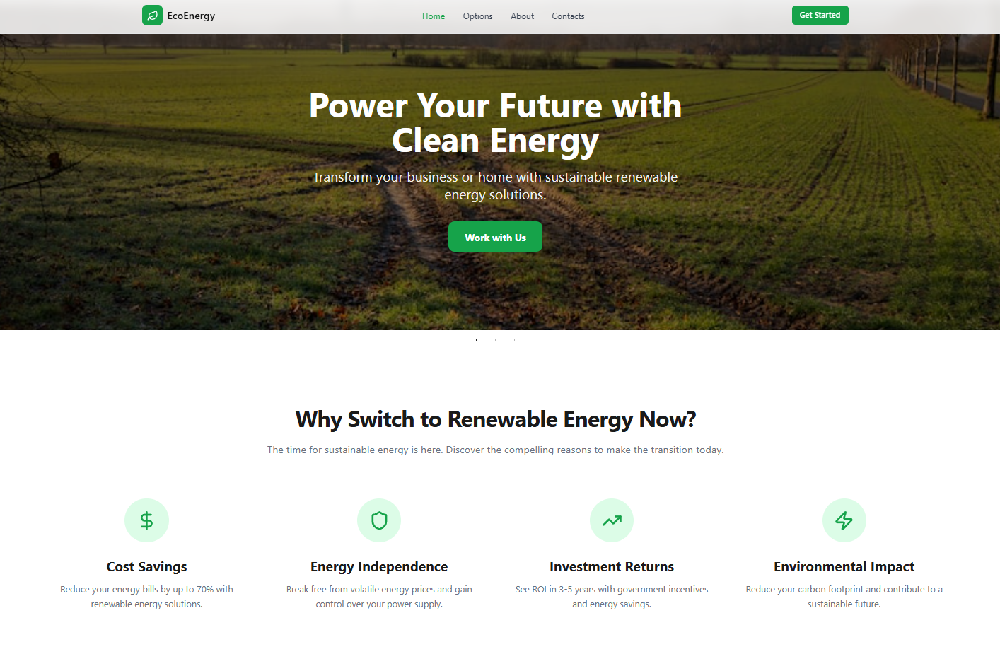
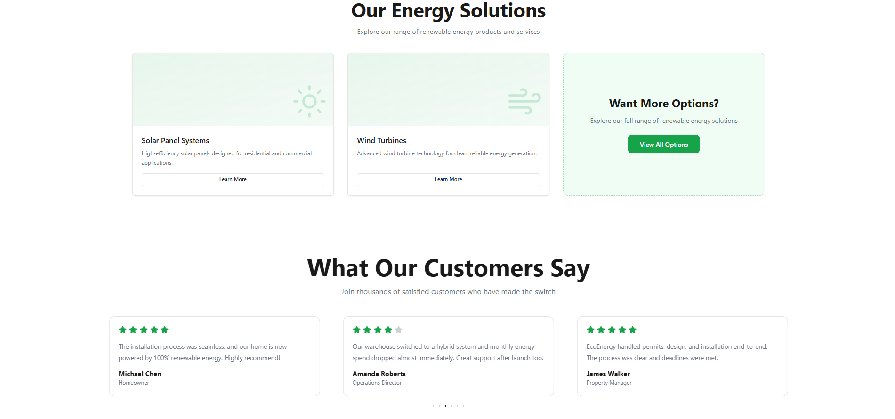
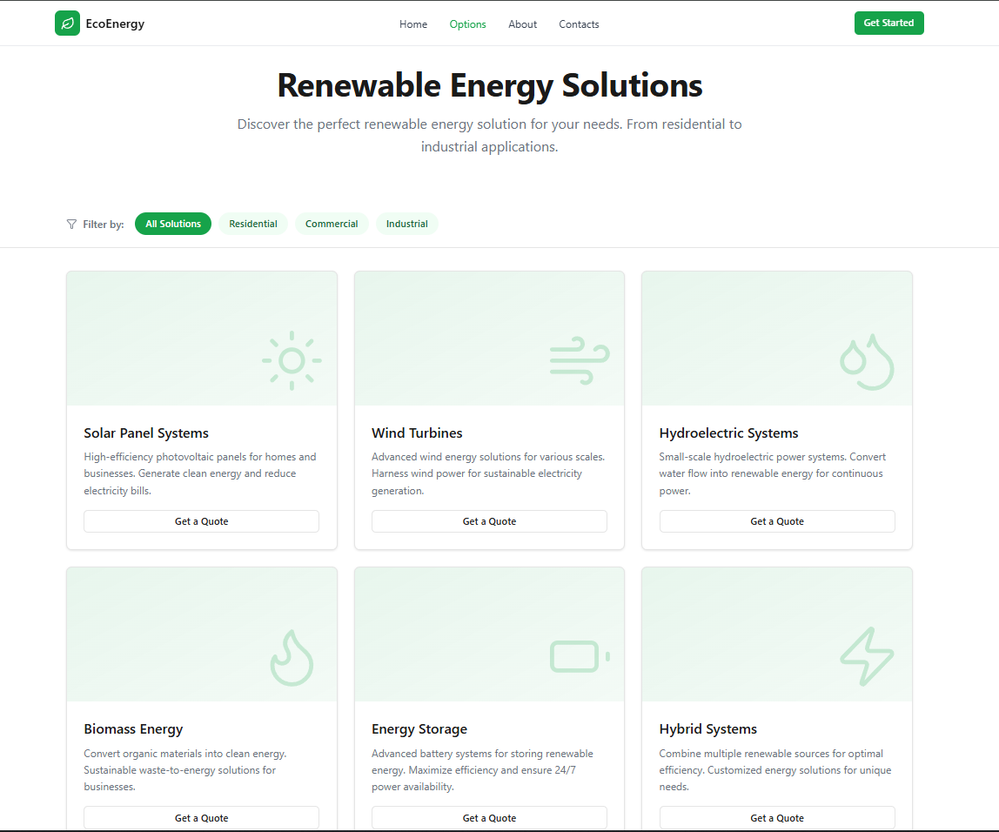
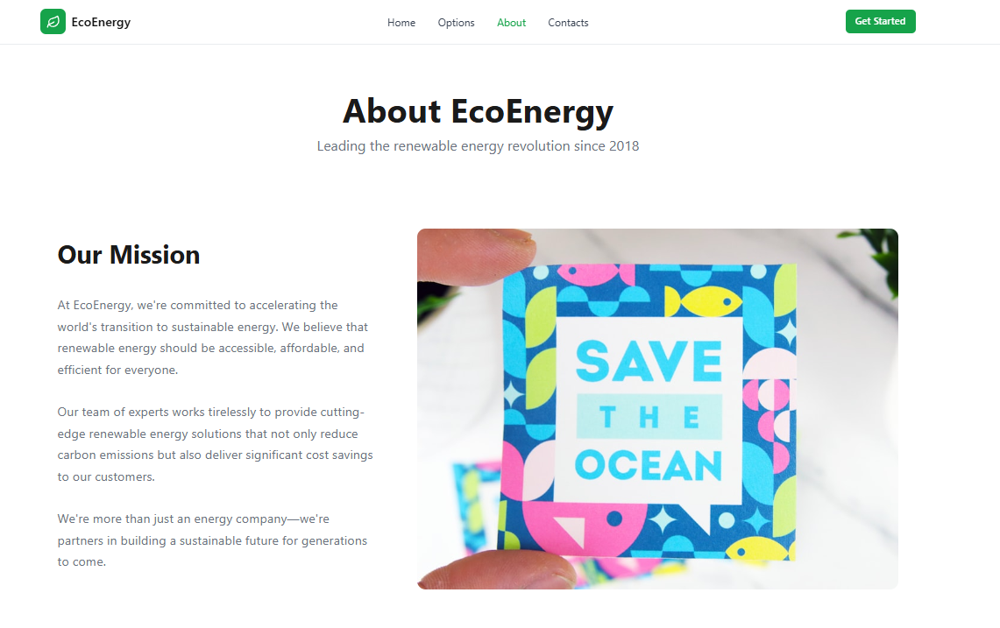
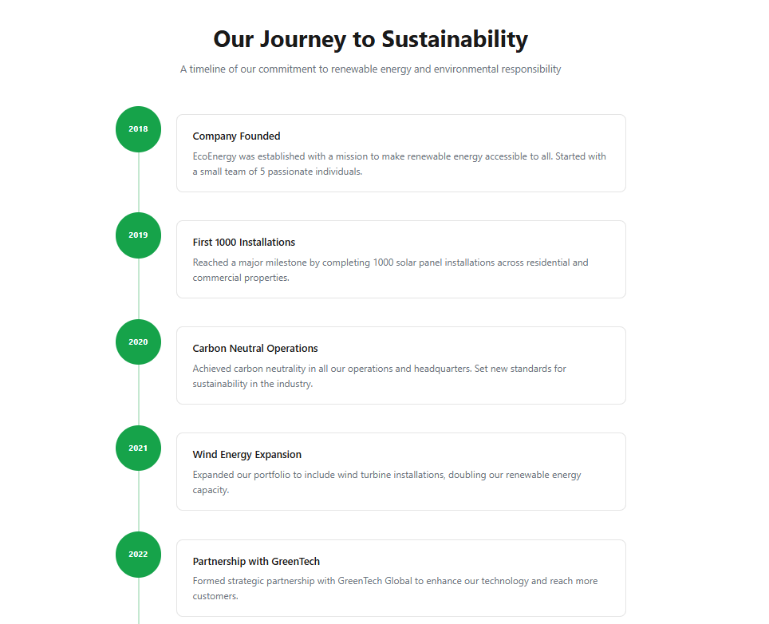
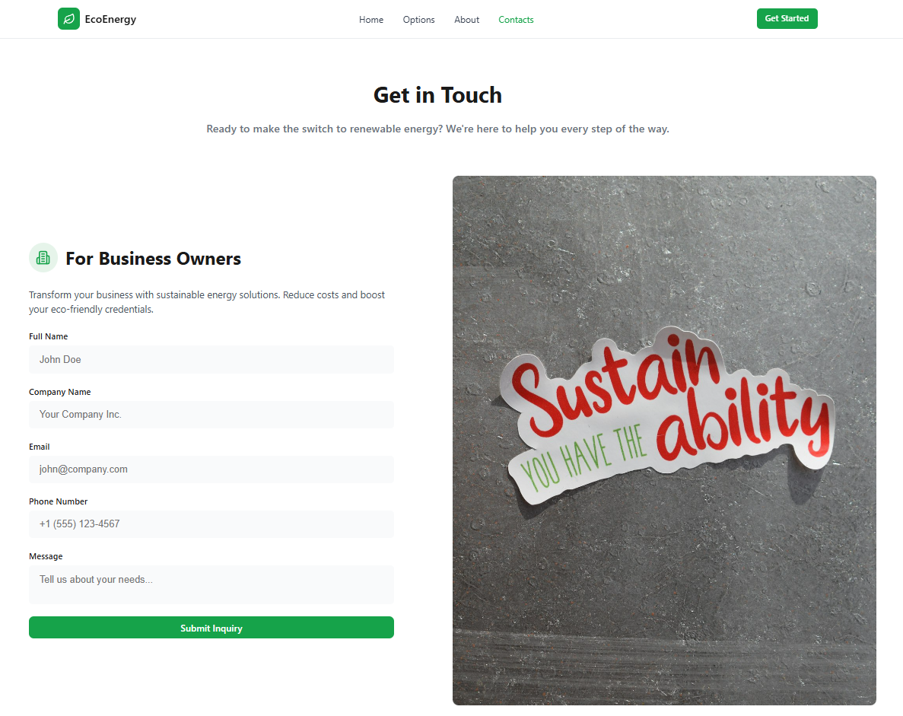

# EcoEnergy

A modern landing site for a renewable energy company. Built with React + Vite, featuring a multi-page layout, dynamic solution filtering, and responsive design throughout.

## Pages

| Route | Description |
|-------|-------------|
| `/` | Home — hero slider, benefits, comparison, solutions overview, testimonials, CTA |
| `/options` | Solutions catalog with category filters (Residential / Commercial / Industrial) |
| `/about` | Company mission, strategic partnerships, milestone timeline |
| `/contacts` | Contact forms for business owners, homeowners, and prospective partners |
| `*` | 404 — page not found fallback |

## Screenshots

### Home




### Options



### About




### Contacts



## Tech Stack

- **React 19** with React Compiler (`babel-plugin-react-compiler`)
- **React Router v7** — client-side routing
- **Vite 7** — build tool
- **CSS Modules** — scoped component styles with CSS custom properties
- **Lucide React** — icon library
- **Swiper** — hero slider
- **React Hook Form** — form state management

## Getting Started

```bash
# Install dependencies
npm install

# Start development server
npm run dev

# Build for production
npm run build

# Preview production build
npm run preview
```

## Project Structure

```
src/
├── components/
│   ├── Benefits/
│   ├── Button/
│   ├── Comparison/
│   ├── ContactForm/
│   ├── CTA/
│   ├── EnergySolutions/
│   ├── ErrorBoundary/       # catches runtime errors, shows fallback UI
│   ├── Footer/
│   ├── Header/
│   ├── Slider/Home/
│   ├── SolutionCard/
│   └── Testimonials/
├── config/
│   └── navigation.js        # shared nav links (used by Header and Footer)
├── pages/
│   ├── About/
│   ├── Contacts/
│   ├── Home/
│   ├── NotFound/            # 404 page
│   └── Options/
│       └── optionsData.js   # solution catalog data
├── App.jsx
├── main.jsx
└── index.css                # CSS custom properties / design tokens
```

## Design Tokens

Global CSS variables are defined in `src/index.css` and used across all components — `--primary`, `--background`, `--foreground`, `--border`, `--muted-foreground`, etc.
